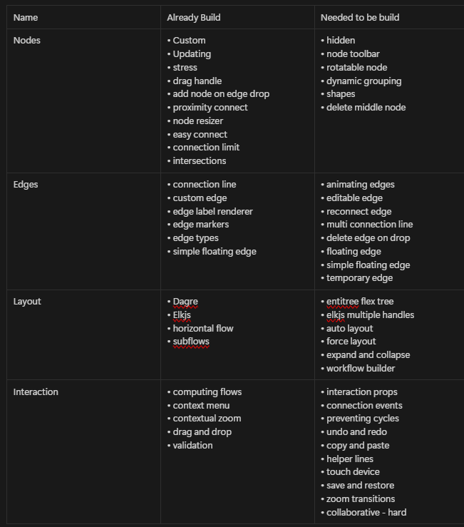

# Svelte Flow Examples

- Build already build examples
- try to build needed to build exmaples
- try out new examples
- build new components for svelte flow - helpful for example context wise

we need tailwind css, shadcn svelte

- navbar
- sidebar - for now we keep it simple both from tailwind ui

[Notion](https://bhide.notion.site/Svelte-Flow-Tricks-159a68828b9b800ea42fed4f55527e80?pvs=4)
